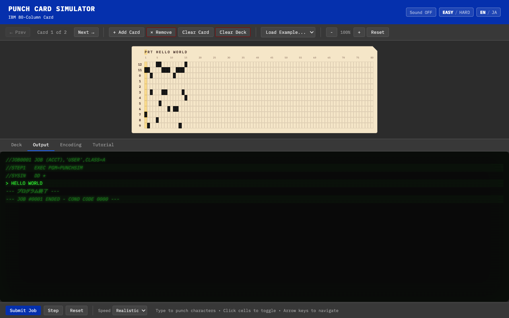

# Punch Card Programming Simulator

An interactive web application that lets you experience programming with IBM 80-column punch cards.



## Getting Started

```bash
npm install
npm run dev
# Open http://localhost:5173
```

### Other Commands

```bash
npm run build     # Production build (output to dist/)
npm run preview   # Preview the build output
```

## Features

### Punch Card Operations
- **Click**: Click a cell to toggle (punch/unpunch) a hole
- **Keyboard Input**: Type characters to auto-punch using IBM 029 encoding
- **Cursor Movement**: Arrow keys / Home / End
- **Backspace**: Clear the previous column
- **Enter**: Move to the next card (adds a new card if at the end)

### Deck Management
- Add, delete, and clear cards
- Prev / Next navigation
- Deck overview panel with thumbnails
- Auto-save to localStorage

### Program Execution
Includes a simple interpreter with 14 instructions. Output is displayed in a terminal-style panel (black background / green text).

| Instruction | Syntax | Description |
|-------------|--------|-------------|
| `PRT` | `PRT text` | Print text |
| `NUM` | `NUM var val` | Assign a number to a variable |
| `ADD` | `ADD var val` | Addition |
| `SUB` | `SUB var val` | Subtraction |
| `MUL` | `MUL var val` | Multiplication |
| `DIV` | `DIV var val` | Division |
| `SHW` | `SHW var` | Print variable value |
| `LBL` | `LBL name` | Define a label |
| `JMP` | `JMP name` | Jump to a label |
| `JEZ` | `JEZ var name` | Jump if zero |
| `JGZ` | `JGZ var name` | Jump if positive |
| `INP` | `INP var` | User input |
| `END` | `END` | End program |
| `REM` | `REM text` | Comment |

### Sample Programs
Load from the dropdown:

- **Hello World** — `PRT HELLO WORLD` → `END`
- **Countdown** — Counts down from 10 and displays `LIFTOFF`
- **Calculator** — Input two numbers and display their sum
- **Fibonacci** — Display the first 10 terms of the Fibonacci sequence

## Tech Stack

- **Vite** — Dev server / build tool
- **TypeScript** — Strict mode
- **IBM Plex Mono** font (Google Fonts)
- No framework dependencies (Vanilla DOM manipulation)

## File Structure

```
punch-card-simulator/
├── index.html          # App shell
├── package.json
├── tsconfig.json
├── vite.config.ts
├── src/
│   ├── main.ts         # Entry point (CSS import + bootstrap)
│   ├── app.ts          # App initialization & state management
│   ├── encoding.ts     # IBM 029 character encoding
│   ├── card.ts         # PunchCard data model
│   ├── deck.ts         # CardDeck management
│   ├── renderer.ts     # Card grid DOM rendering
│   ├── keyboard.ts     # Keyboard input handler
│   ├── interpreter.ts  # Instruction interpreter
│   ├── tutorial.ts     # Tutorial & sample programs
│   └── style.css       # Retro IBM-style CSS
└── dist/               # Build output (not tracked by git)
```

## Deployment

### Cloudflare Pages

```bash
npm run build
wrangler pages deploy dist/
```
